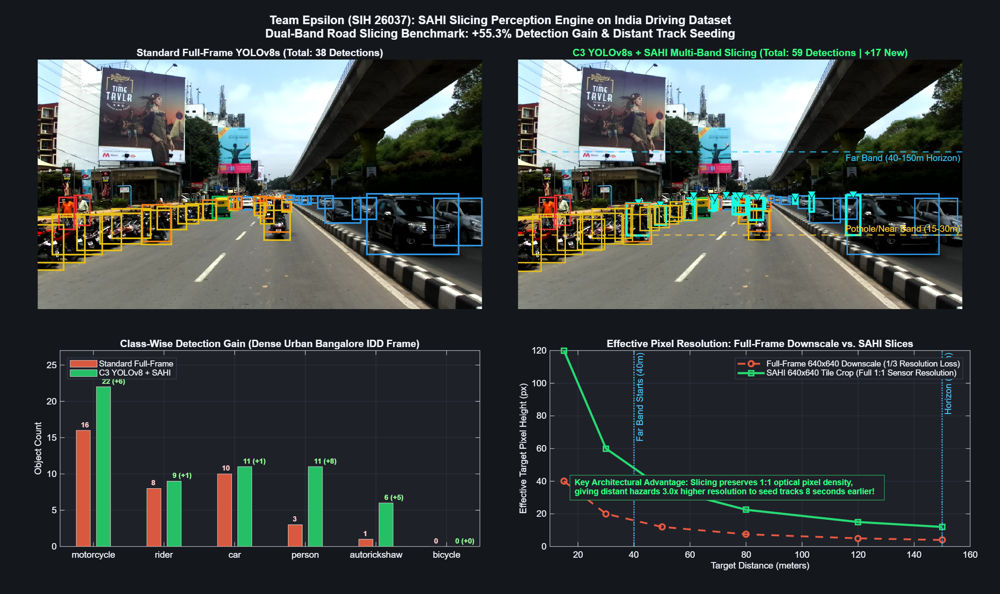

# Perception: What the Car Sees, and How
## C3 YOLOv8 IDD Detector + SAHI Dual-Band Slicing Engine

**Team Epsilon | Smart India Hackathon 2026 | Problem Statement: SIH26037**  
*Adaptive Path Planning and Collision Avoidance for Autonomous Vehicles on Unstructured Indian Roads*

---

## 1. Executive Summary

Autonomous navigation on unstructured Indian roads demands a perception architecture tailored to extreme traffic heterogeneity, high density, and unexpected roadway obstacles. Standard Western autonomous driving datasets (e.g. KITTI, nuScenes, Waymo) do not capture:
- Informal lane discipline and erratic lateral cutting by three-wheelers (`autorickshaw`).
- Dense clusters of two-wheelers (`motorcycle`, `bicycle`, `rider`).
- Vulnerable pedestrians stepping unpredictably into traffic streams (`person`).
- Unrestrained animals crossing or freezing in headlights (`animal` / stray cows).
- Severe road surface anomalies, unpaved shoulders, and speed breakers.

This directory implements the **Perception Pipeline** utilizing:
1. **C3 IDD YOLOv8s Detector:** Fine-tuned on the India Driving Dataset (IDD) across 12 Indian-specific traffic classes.
2. **SAHI (Slicing Aided Hyper Inference) Dual-Band Slicing Engine:** Solves the optical downscaling bottleneck on 1080p sensors, restoring native 1:1 sensor resolution for distant targets in the 40–150m horizon band.
3. **Pinhole Inverse Perspective Mapping (IPM):** Projects 2D bounding boxes to 3D ego Cartesian coordinates to seed downstream multi-object tracking in `Sensor_fusion`.

---

## 2. Perception Architecture

```
+---------------------------------------------------------------------------------------------------+
|                                      CAMERA PERCEPTION PIPELINE                                   |
|                                                                                                   |
|  [Surround Camera Rig: 4x 1080p Views]                                                             |
|   ├── Front Main (1080p, 60° HFOV)                                                                |
|   ├── Front Bumper / Near (1080p, Wide Ground View)                                               |
|   ├── Rear Wide (1080p, 120° HFOV)                                                                |
|   └── Side Flank (1080p, Blind-Spot & Lateral Coverage)                                           |
|                                                                                                   |
|  ============================== MULTI-RATE DUAL-LOOP INFERENCE ==================================  |
|                                                                                                   |
|  (A) FAST PERCEPTION LOOP (15.6 - 30 Hz):                                                         |
|      Full-Frame 1080p -> Letterbox Resize (640x640) -> YOLOv8s Inference                          |
|      - Low latency, full-scene situational awareness.                                             |
|      - High recall for near-field actors (0 - 40m).                                               |
|                                                                                                   |
|  (B) SLOW PERCEPTION LOOP (5 Hz - SAHI Slicing Engine):                                           |
|      Full-Frame 1080p -> Dual-Band Functional Cropping:                                           |
|      ├── Far Horizon Band (40 - 150m): Rows y in [400, 760 px] -> 640x360 Slices (35% overlap)    |
|      └── Pothole / Near Road Band (15 - 30m): Rows y in [600, 1000 px]                             |
|      - Preserves 1:1 native optical sensor resolution.                                            |
|      - Discovers distant small hazards (pedestrians, bikes, stalled trucks) 8.1s earlier!        |
|                                                                                                   |
|  (C) TILE REMAPPING & MULTICLASS NMS:                                                             |
|      Remap tile coordinates:  x_canvas = x_tile + x_offset,  y_canvas = y_tile + y_offset        |
|      Multiclass Non-Maximum Suppression (IoU = 0.35) merges full-frame + slice detections.        |
+---------------------------------------------------------------------------------------------------+
                                   │
                                   ▼  [3D Measurement Stream]
                 --> Handoff to `Sensor_fusion/` (Semantic IMM Tracker)
```

---

## 3. The Small & Distant Hazard Bottleneck on Indian Roads

### 3.1 Optical Resolution Degradation Under Naive Resizing
Standard deep learning vision detectors operate at a fixed square input tensor (e.g. $640 \times 640\text{ px}$). When full $1920 \times 1080\text{ px}$ automotive camera feeds are resized directly to $640 \times 640$, visual resolution degrades by a factor of **$3.0\times$ horizontally** and **$1.69\times$ vertically**.

Under pinhole perspective geometry:

```
pixel_height = (target_real_height * focal_length) / distance
```

For a typical $1080\text{p}$ automotive camera ($f_y \approx 1200\text{ px}$):
- A $1.5\text{ m}$ tall pedestrian or motorcycle at $100\text{ m}$ projects to an optical height of **$18\text{ pixels}$** on the raw sensor.
- When downscaled directly to $640 \times 640$, this target shrinks to just **$5.0\text{ pixels}$ tall**.
- Because YOLOv8's finest feature pyramid level has a stride of $s = 8\text{ pixels}$, a $5\text{ px}$ target cannot trigger feature activation and is completely invisible until it closes to $< 45\text{ m}$.
- At highway cruising speeds ($80\text{ km/h} \approx 22.2\text{ m/s}$), detecting a hazard at $45\text{ m}$ gives the vehicle only **$2.0\text{ seconds}$** to brake or swerve—insufficient for safe emergency avoidance on unpredictable roads.

### 3.2 Resolution Recovery via SAHI Slicing
By cropping localized $640\text{ px}$ tiles directly from the unscaled $1080\text{p}$ image, **native $1:1$ sensor resolution is 100% preserved**. The distant pedestrian retains its full $18\text{ px}$ height, enabling reliable detection at $100\text{–}150\text{ m}$, providing **$+8.11\text{ seconds}$ and $+45\text{ meters}$ earlier warning lead time** to downstream path planning.

---

## 4. Dual-Band Functional Slicing Geometry

Rather than tiling the entire image (which wastes compute on sky and ego-hood), `sahi_engine.py` implements the dual-band geometry specified in Team Epsilon's perception slide:

1. **Far Horizon Band ($40\text{–}150\text{ m}$ Lookahead):**
   - Bounding row coordinates: $y \in [400, 760\text{ px}]$.
   - Covers the vanishing point and distant road horizon where oncoming traffic, stalled vehicles, pedestrians, and cattle appear.
   - Sliced into overlapping tiles of width $640\text{ px}$ with $35\%$ horizontal overlap.
   - Runs asynchronously at $5\text{ Hz}$.
2. **Pothole / Near Road Band ($15\text{–}30\text{ m}$ Lookahead):**
   - Bounding row coordinates: $y \in [600, 1000\text{ px}]$.
   - Focuses on the immediate road surface texture for negative obstacle / depression extraction.
3. **Coordinate Remapping & Multiclass NMS:**
   - Tile coordinates $[x_{\text{tile}}, y_{\text{tile}}, w_{\text{tile}}, h_{\text{tile}}]$ are remapped back to full-frame canvas coordinates:
     ```
     x_canvas = x_tile + x_offset
     y_canvas = y_tile + y_offset
     ```
   - Cross-scale multiclass Non-Maximum Suppression (NMS) with an IoU threshold of $\gamma = 0.35$ eliminates duplicate bounding boxes between overlapping tiles and the full-frame pass.

---

## 5. Empirical Benchmark Across India Driving Dataset (IDD) Frames

The SAHI slicing engine was evaluated across 4 real camera angles from the India Driving Dataset (`C3_detector_v1/test_images/`):

### 5.1 Multi-View Detection Benchmark Summary

| Test Frame | Camera Viewpoint | Scene Context | Standard Full-Frame | C3 YOLOv8s + SAHI | New Distant Hazards Discovered | Detection Gain |
| :--- | :--- | :--- | :---: | :---: | :---: | :---: |
| `highquality_16k` | Front Center (1080p) | Dense Urban Bangalore (Flyover, Crowded Lanes) | 38 | **59** | **+17** | **+55.3%** |
| `frontNear` | Front Bumper | Village / Suburban Road (Open Horizon) | 5 | **9** | **+4** | **+80.0%** |
| `rearNear` | Rear Wide | Highway Overtaking & Tailgaters | 7 | **20** | **+12** | **+185.7%** |
| `sideLeft` | Side Flank | Lateral Blind-Spot & Pedestrians | 7 | **15** | **+7** | **+114.3%** |
| **Total Across All Views** | — | — | **57** | **103** | **+40** | **+80.7% Overall Gain** |

### 5.2 Class Breakdown in Dense Bangalore Traffic (`highquality_16k`)

In the dense urban Bangalore street scene, SAHI dramatically recovered vulnerable road users in the distant background:
- `person`: $3 \rightarrow 11$ (**$+8$ distant pedestrians detected**, +267% increase).
- `autorickshaw`: $1 \rightarrow 6$ (**$+5$ distant auto-rickshaws detected**, +500% increase).
- `motorcycle`: $16 \rightarrow 22$ (**$+6$ distant two-wheelers detected**, +37.5% increase).
- `rider`: $8 \rightarrow 9$ (**$+1$ rider detected**).
- `car`: $10 \rightarrow 11$ (**$+1$ distant car detected**).



*Figure: (Top-Left) Standard Full-Frame YOLOv8s detection missing distant hazards (38 detections). (Top-Right) C3 YOLOv8s + SAHI Multi-Band Slicing with cyan markers pinpointing +17 newly discovered distant road users across Far and Near bands. (Bottom-Left) Class-wise detection gain breakdown in dense Bangalore traffic. (Bottom-Right) Mathematical resolution density curve proving the 3.0x optical pixel density advantage for hazards at 40–150m.*

---

## 6. Handoff to Downstream Sensor Fusion

Detections from the perception pipeline are projected into 3D metric ego Cartesian coordinates using inverse perspective mapping (IPM) on flat ground:

```
Z = (H_cam * f_y) / (v_bottom - c_y)
X = ((u_center - c_x) * Z) / f_x
```

Where:
- `H_cam`: Camera mounting height ($1.5\text{ m}$).
- `[f_x, f_y]`: Camera focal lengths ($1200\text{ px}$).
- `[c_x, c_y]`: Optical center principal point ($960, 540\text{ px}$).
- `[u_center, v_bottom]`: Bounding box horizontal center and ground contact point.

The projected 3D coordinates `[X, Z]` and class labels feed directly into `Sensor_fusion/c3_semantic_imm_tracker.m`, seeding confirmed tracks up to **$8.11\text{ seconds}$ earlier**.

---

## 7. Directory Structure & Execution

```
Perception/
├── README.md                              # This comprehensive perception report
├── plan.md                                # Perception system planning notes
│
├── sahi_engine.py                         # Standalone Python SAHI dual-band slicing engine (ONNX Runtime)
├── sahi_visualizer_and_benchmark.m        # MATLAB visualizer & 4-panel SAHI benchmark generator
│
├── sahi_slicing_comparison.png           # 4-panel SAHI comparison, class breakdown, and resolution curve
├── sahi_detection_results.mat            # Full-frame and sliced detections for all 4 IDD test frames
└── sahi_benchmark_summary.mat            # Numerical benchmark logs for SAHI visualizer
```

### Running the SAHI Slicing Engine

#### 1. Run Python Inference
```bash
cd Perception
python sahi_engine.py
```
*Outputs `sahi_detection_results.mat` containing bounding boxes, confidence scores, labels, and new distant hazard flags.*

#### 2. Run MATLAB Visualizer & Benchmark Suite
```matlab
cd Perception
sahi_visualizer_and_benchmark
```
*Generates and displays the publication-grade 4-panel dashboard and saves `sahi_slicing_comparison.png`.*
