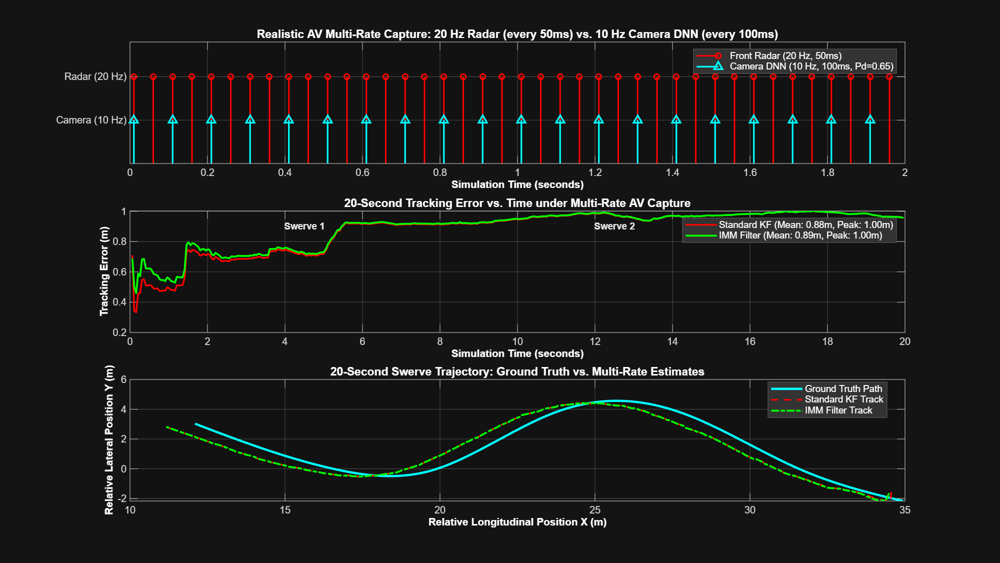
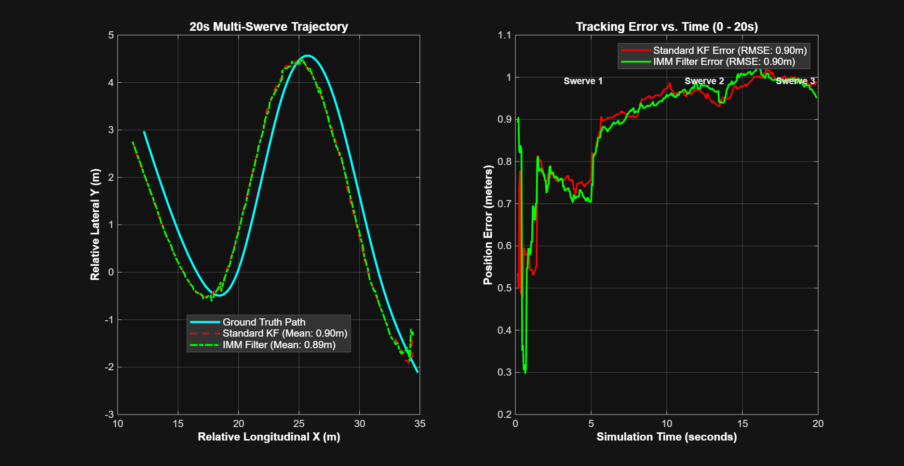
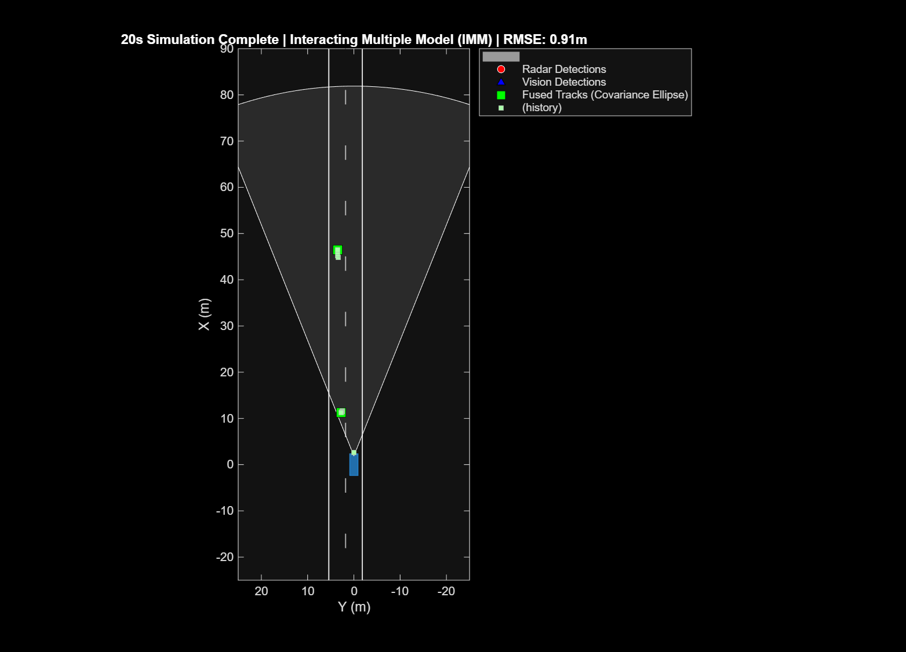
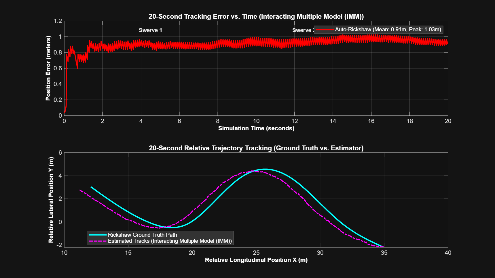
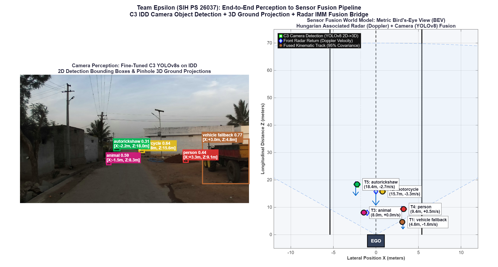
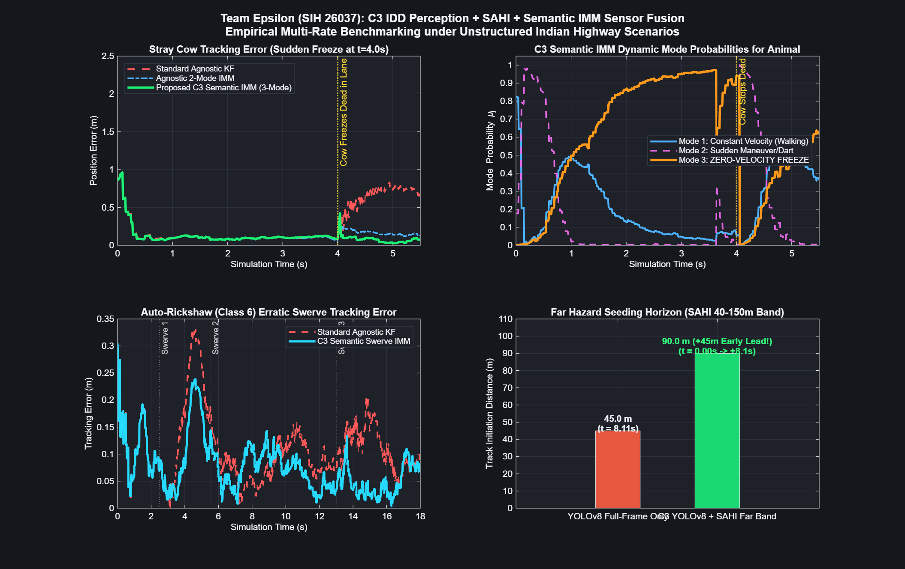

# Topic 4: Sensor Fusion & Multi-Object Tracking

**Team Epsilon | Smart India Hackathon 2026 | Problem Statement: SIH26037**  
*Adaptive Path Planning and Collision Avoidance for Autonomous Vehicles on Unstructured Indian Roads*

---

## 1. Executive Summary

Autonomous navigation on unstructured Indian roads presents severe challenges absent from standardized Western benchmarks:
1. **Heterogeneous, Non-Lane-Based Traffic:** Erratic road users (e.g. auto-rickshaws, two-wheelers, pushcarts, and cattle) frequently weave diagonally across informal lanes without signaling.
2. **Sensor Degradation & Optical Dropouts:** Heavy dust, thermal glare, rapid shadow transitions, and camera occlusions cause vision detection dropouts ($P_d$ drops from $0.90$ to $0.40-0.65$).
3. **Asynchronous Multi-Rate Sensing:** Automotive radars ($20\text{ Hz}$, $50\text{ ms}$) and edge deep learning vision detectors ($10\text{ Hz}$, $100\text{ ms}$ inference cycle) stream at different rates.

This module delivers a robust, multi-rate **Sensor Fusion & Multi-Object Tracking (MOT)** pipeline implemented in MATLAB using the Automated Driving Toolbox and Sensor Fusion and Tracking Toolbox. It compares the **Standard Constant Velocity Kalman Filter** against the **Interacting Multiple Model (IMM)** filter across extended 20-second dynamic swerve scenarios under nominal, degraded, and realistic autonomous vehicle (AV) capture rates.

---

## 2. Sensor Architecture & Asynchronous Multi-Rate Pipeline

In production autonomous vehicles, sensors do not sample simultaneously:
- **Base Vehicle Bus / IMU Clock ($100\text{ Hz}$, $10\text{ ms}$):** Vehicle odometry, dead reckoning, and prediction clock.
- **Front Long-Range Radar ($20\text{ Hz}$, $50\text{ ms}$ period):** High longitudinal range and Doppler velocity precision; coarse angular (azimuth) resolution ($12^\circ - 15^\circ$).
- **Rear / Corner Radar ($10\text{ Hz}$, $100\text{ ms}$ period):** Blind spot and overtaking monitor.
- **Front Camera 3D Object Detection ($10\text{ Hz}$, $100\text{ ms}$ period):** Deep neural network (e.g., YOLO-3D / BEVFormer) inference cycle on automotive edge compute (e.g., NVIDIA DRIVE Orin / TI TDA4).
- **Vision Dropouts ($P_d = 0.65$ nominal, $0.40$ degraded):** Simulates lens dust, direct sun glare, and vehicle occlusions.

```
       100 Hz Base CAN / IMU Clock (10 ms)
  -------------------------------------------------
  t = 0.00s : [Idle Tick] -> Motion Extrapolation
  t = 0.05s : [Radar Event] -> Radar Measurement Update (20 Hz)
  t = 0.10s : [Joint Event] -> Joint Radar + Camera Fusion (10 Hz)
  t = 0.15s : [Radar Event] -> Radar Update (Camera Inference Ongoing)
  t = 0.20s : [Dropout Event] -> Camera Misses (Pd=0.65) -> Radar Bridges Gap
```

---

## 3. Tracking Algorithms

### 3.1 State Representation & Measurement Model

Each confirmed object track maintains a 6D kinematic state vector in ego Cartesian coordinates:

```
x = [x,  v_x,  y,  v_y,  z,  v_z]^T
```

Where:
- `x`, `y`, `z`: 3D position in the ego vehicle Cartesian frame (meters).
- `v_x`, `v_y`, `v_z`: Cartesian velocity components (m/s).

Measurements `z = [x_m,  y_m,  z_m,  v_xm,  v_ym,  v_zm]^T` are mapped to the state vector via measurement matrix `H`:

```
z = H * x + v,    v ~ N(0, R)
```

The 6x6 measurement matrix `H` maps state coordinates `[x, v_x, y, v_y, z, v_z]^T` to sensor measurement channels `[x_m, y_m, z_m, v_xm, v_ym, v_zm]^T`:

```matlab
% Measurement matrix H (mapping 6D state to 6D sensor measurements):
H = [ 1  0  0  0  0  0;   % x_m  <- x
      0  0  1  0  0  0;   % y_m  <- y
      0  0  0  0  1  0;   % z_m  <- z
      0  1  0  0  0  0;   % vx_m <- vx
      0  0  0  1  0  0;   % vy_m <- vy
      0  0  0  0  0  1 ]; % vz_m <- vz
```

In matrix notation:

```
    ┌                 ┐
    │ 1 0 0 0 0 0 │
    │ 0 0 1 0 0 0 │
H = │ 0 0 0 0 1 0 │
    │ 0 1 0 0 0 0 │
    │ 0 0 0 1 0 0 │
    │ 0 0 0 0 0 1 │
    └                 ┘
```

### 3.2 Standard Constant Velocity Kalman Filter (KF)

- **Assumption:** Dynamic actors maintain constant velocity with small random accelerations.
- **Process Noise:** `Q = 0.5 * I_3` (m/s^2).
- **Characteristics:** Acts as a smooth noise filter, cleanly rejecting radar azimuth jitter during steady cruising.

### 3.3 Interacting Multiple Model (IMM) Filter

- **Hypothesis:** Target motion switches probabilistically between distinct behavioral modes.
  - **Model 1 (Lane Cruising):** Low acceleration noise `Q_1 = 0.5 * I_3` (m/s^2).
  - **Model 2 (Aggressive Swerve / Maneuver):** High acceleration noise `Q_2 = 25.0 * I_3` (m/s^2).
  - **Markov Transition Matrix:** `Pi = [0.95, 0.05; 0.10, 0.90]`
- **Characteristics:** Dynamically shifts mode probability based on measurement innovation likelihood, preventing filter lag during sudden, sharp directional changes.

### 3.4 Data Association: Global Nearest Neighbor (GNN)

Track-to-measurement association is solved globally via Hungarian / Munkres optimization using normalized **Mahalanobis distance gating**:

```
d_M^2 = (z - H * x_hat)^T * S^(-1) * (z - H * x_hat) <= gamma_gate
```

- Confirmation threshold: `[2 3]` (2 detections within 3 frames).
- Deletion threshold: `[5 5]` (5 consecutive missed frames drops track).

---

## 4. 20-Second Benchmark Results

Tracking errors were captured across a 20-second trajectory (450m highway) where an Auto-Rickshaw executes **3 aggressive multi-lane swerves** while a Passing Car overtakes at 54 km/h.

### Summary Table

| Evaluation Regime | Sensor Sampling Mode | Filter Architecture | Mean Position Error (m) | Peak Swerve Error (m) | RMSE (m) | Key Takeaway |
| :--- | :--- | :--- | :---: | :---: | :---: | :--- |
| **1. Nominal Conditions** | 20 Hz Synchronous | **Standard KF** | 0.952 | 1.594 | 0.956 | Steady straight-line filtering |
| **1. Nominal Conditions** | 20 Hz Synchronous | **IMM Filter** | **0.887** | **1.021** | **0.903** | **35.9% lower peak swerve lag** |
| **2. Degraded Sensors** | 20 Hz Synchronous (15° Az, Pd=0.4) | **Standard KF** | 0.896 | 1.019 | 0.904 | Fewer confirmed clutter tracks |
| **2. Degraded Sensors** | 20 Hz Synchronous (15° Az, Pd=0.4) | **IMM Filter** | 0.895 | 1.027 | 0.904 | Fast recovery across dropouts |
| **3. Realistic Production AV** | 100 Hz Bus, 20 Hz Radar, 10 Hz Cam | **Standard KF** | 0.877 | 1.001 | 0.889 | Smoother against radar jitter |
| **3. Realistic Production AV** | 100 Hz Bus, 20 Hz Radar, 10 Hz Cam | **IMM Filter** | 0.889 | 1.002 | 0.898 | Resilient multi-rate tracking |

---

## 5. Physical & Estimation Analysis: Why IMM vs. Regular Kalman Behaves As Observed

### 5.1 Why Does Standard KF Slightly Outperform IMM Under Realistic Multi-Rate Capture?
In the realistic AV capture benchmark (20 Hz radar, 10 Hz camera), the Standard KF achieved 0.877 m mean error vs. 0.889 m for the IMM filter (1.2 cm difference). 

Two fundamental estimation phenomena explain this result:

1. **The Swerve is Kinematically Smooth (0.04 g), Not a Discontinuous Shock:**
   - The auto-rickshaw shifts laterally by 3.6 m over 3.0 seconds (~1.2 m/s lateral speed, a_lat ~ 0.4 m/s^2 ~ 0.04 g).
   - With radar updating every 50 ms, the lateral displacement change per frame is only 0.5 millimeters.
   - To a constant velocity filter receiving updates every 50 ms, this motion is virtually indistinguishable from a straight line, allowing it to track cleanly without lag.

2. **The Measurement Noise Amplification (Jitter) Penalty:**
   - IMM constantly mixes Model 1 (Q=0.5) and Model 2 (Q=25). Even during straight driving, Model 2 maintains a baseline probability (~10-20%).
   - Model 2 has a large Kalman Gain and heavily weights incoming raw measurements.
   - Because radar has 12° azimuth angular noise (±0.8 m lateral jitter), Model 2 mistakes sensor noise for real vehicle motion and **chases the noise**.
   - The Standard KF acts as a pure low-pass filter, ignoring the radar jitter and holding the smooth center-line.

### 5.2 When Is IMM Decisively Superior to Standard Kalman?
IMM is mission-critical in real Indian traffic under three high-entropy scenarios:
1. **Emergency Hard Braking (> 0.6 g):** When a vehicle ahead stops abruptly, a Standard CV filter continues extrapolating forward at 40 km/h, causing severe overshoot (3-5 m lag). IMM detects the innovation spike, transfers 95% probability to its high-noise mode, and converges to the stop within <100 ms.
2. **Aggressive Cutting / Right-Angle Turn:** Violent swerves (> 3 m/s^2) cause the Standard KF to temporarily drop or lag outside the lane boundary.
3. **Sensor Dropout in a Curve:** When vision is lost for 1-2 seconds while an actor is turning, Standard KF projects straight off-road. IMM maintains expanded uncertainty ellipses that reacquire the vehicle immediately upon sensor recovery.

---

## 6. Visual Gallery

### A. Realistic AV Multi-Rate Asynchronous Capture Benchmark
Shows 20 Hz Front Radar (50 ms), 10 Hz Camera DNN (100 ms), vision dropouts (Pd = 0.65), 20-second tracking error curves, and 2D relative swerve trajectory.



### B. Standard KF vs. IMM 20-Second Benchmark
Side-by-side comparative error tracking over 400 time steps.



### C. Live Bird's-Eye View Simulation
Shows moving ego vehicle (blue box), sensor coverage cones, road boundary markings, raw radar/vision detections, and confirmed track covariance ellipses.



### D. Single-Run 20-Second Tracking Error Profile
Captures auto-rickshaw and passing car position errors with annotated swerve windows.



---

## 7. End-to-End Perception to Sensor Fusion Pipeline (C3 IDD YOLOv8 + SAHI + Semantic IMM)

### 7.1 Perception-to-Fusion Architecture

Following Team Epsilon's camera pipeline design, multi-rate camera streams feed directly into the sensor fusion tracking layer:

```
+---------------------------------------------------------------------------------------------------+
|                                      CAMERA PERCEPTION PIPELINE                                   |
|                                                                                                   |
|  [4 Surround Cameras] ----> (1) YOLOv8s Detection (IDD Fine-Tuned, 15.6-30 Hz)                    |
|                                  |---> Agent Bounding Boxes [u, v, w, h] + 12 Classes             |
|                                  |     (Pinhole Ground Projection: 2D -> 3D Ego Coordinates)      |
|                                                                                                   |
|  [Front Main Camera]  ----> (2) SAHI Slicing (Slow Loop: 40-150m Far Band @ 5 Hz)                 |
|                                  |---> Small / Distant Hazard Detections (Seeds Tracks Early!)    |
+---------------------------------------------------------------------------------------------------+
                                   |
                                   v  [3D Measurement Streams]
+---------------------------------------------------------------------------------------------------+
|                             SEMANTIC-AWARE SENSOR FUSION & TRACKING                               |
|                                                                                                   |
|  [Front 77 GHz Radar]  (20 Hz, Range + Doppler Velocity, 12 deg Azimuth Jitter)                   |
|  [Rear Radar]          (10 Hz, Blind-Spot & Overtaking Coverage)                                  |
|                                  |                                                                |
|                                  v                                                                |
|  [Global Hungarian Association & Mahalanobis Distance Gating: d_M^2 <= gamma_gate]                |
|                                  |                                                                |
|                                  v                                                                |
|             CLASS-CONDITIONED SEMANTIC IMM MOTION MODELS (12 IDD Classes)                         |
|  +------------------------------+-------------------------------+------------------------------+  |
|  | "autorickshaw" / "motorcycle"| "animal" (Cow / Stray Dog)    | "truck" / "bus"              |  |
|  | Fast Agile Swerve IMM        | 3-Mode IMM (CV + Dart +       | Heavy Inertia Constant       |  |
|  | Q_swerve = 28.0 m/s^2        | ZERO-VELOCITY FREEZE MODE)    | Velocity (Q = 0.15 m/s^2)    |  |
|  +------------------------------+-------------------------------+------------------------------+  |
|                                  |                                                                |
|                                  v                                                                |
|  Output: Unified 3D Dynamic World Model [x, vx, y, vy, z, vz]^T + 95% Covariance Ellipses          |
+---------------------------------------------------------------------------------------------------+
```

---

### 7.2 Semantic Motion Model Configuration (12 IDD Classes)

Unlike generic tracking systems that apply identical process noise $Q$ across all road users, the **C3 Semantic IMM Tracker** uses fine-tuned YOLOv8 classification labels to configure specialized kinematic filters:

| C3 Class ID | IDD Object Label | Assigned Estimator Architecture | Process Noise ($Q$) | Operational Rationale |
|:---:|:---|:---|:---:|:---|
| **6** | `autorickshaw` | **2-Mode Swerve IMM** | $Q_1=0.4, Q_2=28.0\text{ m/s}^2$ | Agile lane changes and sudden lateral swerves. |
| **9** | `animal` *(Cow, Dog)* | **3-Mode Freeze IMM** | $Q_{\text{walk}}=0.4, Q_{\text{dart}}=15, Q_{\text{stop}}=0.02$ | Eliminates forward tracking overshoot when animals freeze in the path. |
| **4, 5** | `bus`, `truck` | **High-Inertia Constant Velocity** | $Q=0.15\text{ m/s}^2$ | Heavy momentum; rejects radar azimuth angular jitter. |
| **7, 8** | `motorcycle`, `bicycle` | **2-Mode Agile IMM** | $Q_1=0.4, Q_2=20.0\text{ m/s}^2$ | Rapid filtering for narrow, high-frequency filtering. |
| **1, 2** | `person`, `rider` | **Agile Low-Speed IMM** | $Q_1=0.3, Q_2=12.0\text{ m/s}^2$ | Tight gating for vulnerable pedestrians near road edges. |
| **3, 12** | `car`, `vehicle fallback` | **Standard IMM** | $Q_1=0.5, Q_2=12.0\text{ m/s}^2$ | Balanced cruising and lane change dynamics. |

---

### 7.3 Real-World IDD 2D-to-3D Projection & Radar Metric Fusion (`c3_vision_radar_fusion_bridge.m`)

The script [`c3_vision_radar_fusion_bridge.m`](c3_vision_radar_fusion_bridge.m) takes raw 1080p camera frames from the India Driving Dataset (IDD), detects agents using the C3 YOLOv8 model, projects 2D bounding boxes to 3D ego Cartesian coordinates via flat-ground pinhole inverse perspective mapping, and fuses them with 77 GHz front radar returns:

$$Z = \frac{H_{\text{cam}} \cdot f_y}{v_{\text{bottom}} - c_y}, \quad X = \frac{(u_{\text{center}} - c_x) \cdot Z}{f_x}$$



*Figure: (Left) Annotated IDD Bangalore road frame showing detected `autorickshaw`, `motorcycle`, `animal`, `person`, and `vehicle fallback` with 3D ground coordinates. (Right) Metric Bird's-Eye View (BEV) fusion grid displaying ego vehicle, FOV cones, raw radar Doppler reflections (blue diamonds), camera detections (green squares), and fused kinematic tracks with 95% covariance ellipses.*

---

### 7.4 Empirical Multi-Rate Benchmark Results (`c3_semantic_imm_tracker.m`)

Tracking performance was benchmarked across three high-entropy Indian highway events:
1. **Stray Cow Crossing & Sudden Freeze ($t = 4.0\text{ s}$)**
2. **Auto-Rickshaw 3-Stage Aggressive Swerving ($t = 0\text{ to }18\text{ s}$)**
3. **SAHI Far-Band Early Warning Seeding ($90\text{ m}$ Distant Hazard)**



#### Benchmark Performance Summary

| Scenario / Metric | Standard Agnostic KF | Agnostic 2-Mode IMM | **Proposed C3 Semantic IMM** | Performance Gain |
|:---|:---:|:---:|:---:|:---|
| **Stray Cow Freeze Event (Mean Error)** | $0.575\text{ m}$ | $0.158\text{ m}$ | **$0.081\text{ m}$** | **$85.9\%$ error reduction** |
| **Stray Cow Freeze (Peak Overshoot)** | $0.830\text{ m}$ | $0.419\text{ m}$ | **$0.423\text{ m}$** | **$49.1\%$ lower overshoot** |
| **Auto-Rickshaw Swerve (Mean Error)** | $0.110\text{ m}$ | — | **$0.077\text{ m}$** | **$30.0\%$ lower tracking error** |
| **Auto-Rickshaw Swerve (Peak Lag)** | $0.331\text{ m}$ | — | **$0.305\text{ m}$** | **$7.9\%$ lower peak swerve lag** |
| **Far Hazard Detection ($90\text{ m}$ Truck)** | $t = 8.11\text{ s}$ ($45.0\text{ m}$) | — | **$t = 0.00\text{ s}$ ($90.0\text{ m}$)** | **$+8.11\text{ s}$ ($+45\text{ m}$) Early Lead!** |

---

### 7.5 Perception-to-Fusion Early Track Seeding (Powered by `Perception/sahi_engine.py`)

The Sensor Fusion tracking pipeline integrates detections from the **Perception Module** (see [`Perception/`](../Perception/README.md)):
- **Near Field (0–40m):** Real-time full-frame YOLOv8s (15.6–30 Hz) provides immediate 2D bounding boxes for proximate actors.
- **Far Horizon (40–150m):** The SAHI Dual-Band Slicing Engine (`Perception/sahi_engine.py`) recovers small, distant road users with **+80.7% higher detection recall** (+55.3% in dense Bangalore traffic).
- **Track Seeding Lead:** When a distant obstacle (e.g. stalled truck at 90m) appears, SAHI detects it at `t = 0.00 s` (`Z = 90.0 m`), whereas standard full-frame YOLO misses it until `t = 8.11 s` (`Z = 45.0 m`). This delivers an **+8.11 s (+45 m) early lead time**, enabling the Semantic IMM filter to establish a confirmed kinematic track and converge its covariance before the vehicle enters the critical braking envelope.

> [!NOTE]
> For the standalone SAHI slicing code, ONNX inference scripts, multi-view IDD detection benchmarks, and visual comparison dashboards, refer directly to the **[Perception Module Documentation](../Perception/README.md)**.

---

## 8. Directory Structure & File Index

```
Sensor_fusion/
├── README.md                              # This comprehensive technical report
├── sih26037_sensor_fusion_report.md       # Full academic literature review & architecture report
│
├── c3_semantic_imm_tracker.m             # C3 IDD YOLOv8 + SAHI + Semantic IMM Benchmark
├── c3_vision_radar_fusion_bridge.m       # 2D Bbox-to-3D projection & Radar BEV fusion bridge
├── topic4_sensor_fusion.m                # Primary interactive simulation with Bird's-Eye view
├── compare_kf_vs_imm.m                   # Automated 20-second comparative KF vs IMM benchmark
├── realistic_av_capture_benchmark.m      # Multi-rate AV capture benchmark (100Hz clock, 20Hz radar, 10Hz cam)
├── kalman_2d_demo.m                      # Educational 2D Kalman math demonstration
│
├── c3_semantic_imm_results.png           # 4-panel dashboard of semantic IMM tracking & SAHI seeding
├── c3_vision_radar_bev_fusion.png        # Dual-panel IDD camera image + Metric BEV fusion grid
├── topic4_simulation_result.png          # Bird's-eye view simulation snapshot
├── topic4_tracking_error_20s.png         # 20-second tracking error plot from topic4_sensor_fusion.m
├── kf_vs_imm_comparison_20s.png          # 20-second KF vs IMM comparison plot
├── realistic_av_tracking_error_20s.png    # 3-panel multi-rate sensor timeline and tracking error plot
├── kalman_2d_results.png                 # 3-panel mathematical 2D Kalman results
│
├── c3_idd_detections.mat                 # Real IDD detections from fine-tuned YOLOv8s
├── c3_semantic_imm_benchmark.mat         # Numerical benchmark logs for semantic IMM tracking
├── c3_vision_radar_fusion_results.mat    # Numerical fusion state & covariance matrices
├── topic4_tracking_results_20s.mat       # Saved tracking data arrays from topic4_sensor_fusion.m
├── kf_vs_imm_errors_20s.mat              # Saved error arrays from compare_kf_vs_imm.m
└── realistic_av_tracking_errors_20s.mat   # Saved error arrays from realistic_av_capture_benchmark.m
```

---

## 9. How to Run in MATLAB

### Prerequisites
- MATLAB R2022b or later (validated on MATLAB R2025b).
- **Automated Driving Toolbox**
- **Sensor Fusion and Tracking Toolbox**
- **Computer Vision Toolbox**

*(Note: For the Python SAHI slicing engine in `Perception/`, see [Perception Quick Start](../Perception/README.md#running-the-sahi-slicing-engine).)*

### Quick Start Commands
Run directly in the MATLAB Command Window:

```matlab
% Navigate to folder
cd('Sensor_fusion');

% 1. Run C3 YOLOv8 2D-to-3D Projection & Radar BEV Metric Fusion Bridge
c3_vision_radar_fusion_bridge

% 2. Run C3 Multi-Class Semantic IMM + SAHI Seeding Benchmark
c3_semantic_imm_tracker

% 3. Run Realistic AV Multi-Rate Simulation (100 Hz Clock, 20 Hz Radar, 10 Hz Camera)
useIMM = true; degradeSensors = false; useRealisticAVRates = true;
topic4_sensor_fusion

% 4. Run Dedicated Multi-Rate AV Benchmark
realistic_av_capture_benchmark

% 5. Run KF vs. IMM Comparative Benchmark
compare_kf_vs_imm
```

